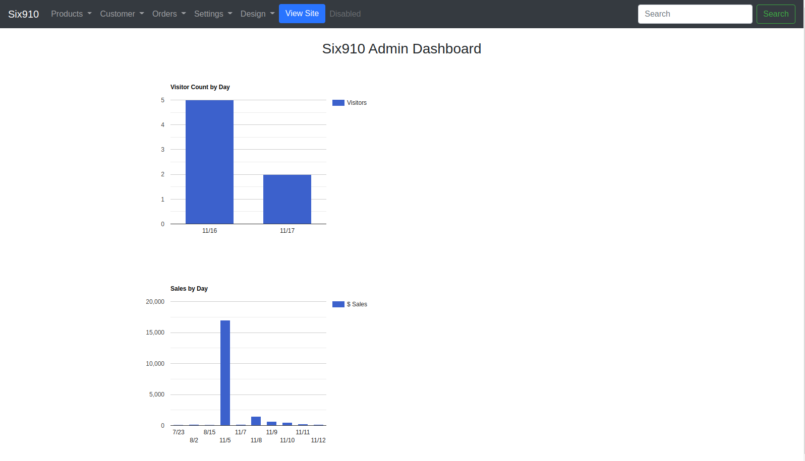

# Six910 UI

## Docker
https://hub.docker.com/r/ulboralabs/six910-ui

### Project Status
Six910 is currently a Release Candidate (RC) and currently running on multiple sites.

### The Speeding Fast Shopping Cart
An open source ecommerce platform server for building online shopping cart systems; written in golang. This is the user's storefront and admin panel.

This project is the storefront UI that works with Six910 REST implementation of a hosted ecommerce solution. 

1. Users of Six910 UI, together with Six910 will be able to customize templates just like other hosted solutions.
2. Templates can either be written in Golang templating or use a JavaScript framework like Angular or React.
3. REST services expose all cart functionality.

## Admin Dashboard

## Template Designer
There will also be a template designer to make desiging templates much easier than it currently is with most hosted shopping cart solutions.

1. Users can download there current template
2. Modify the template using the user's store URL
3. Upload the template back to the hosted site

